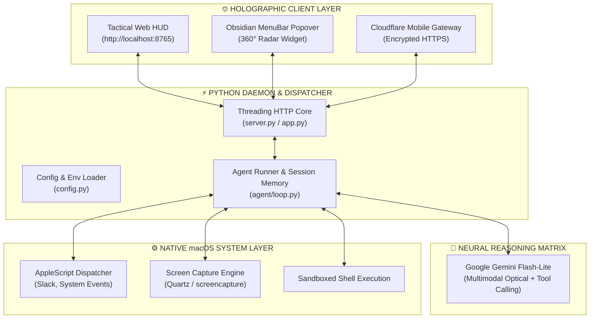

<div align="center">

```
  ██╗     ██╗  ██╗ ██████╗     ███╗   ███╗ █████╗ ██████╗ ██╗  ██╗    ██████╗     ██╗  ██╗
  ██║     ██║ ██╔╝██╔═══██╗    ████╗ ████║██╔══██╗██╔══██╗██║ ██╔╝    ╚════██╗    ██║  ██║
  ██║     █████╔╝ ██║   ██║    ██╔████╔██║███████║██████╔╝█████╔╝      █████╔╝    ███████║
  ██║     ██╔═██╗ ██║   ██║    ██║╚██╔╝██║██╔══██║██╔══██╗██╔═██╗      ╚═══██╗    ╚════██║
  ███████╗██║  ██╗╚██████╔╝    ██║ ╚═╝ ██║██║  ██║██║  ██║██║  ██╗    ██████╔╝         ██║
  ╚══════╝╚═╝  ╚═╝ ╚═════╝     ╚═╝     ╚═╝╚═╝  ╚═╝╚═╝  ╚═╝╚═╝  ╚═╝    ╚═════╝          ╚═╝
```

### ⚡ AUTONOMOUS macOS NEURAL ASSISTANT & HOLOGRAPHIC HUD ⚡
*Engineered with Tony Stark's JARVIS Interface • Aerolite Obsidian Menu Bar • Gemini Multimodal Vision • AppleScript Automations*

<br/>

[](https://github.com/shubhransh-gupta/LKO-Mark-3.4)
[](https://github.com/shubhransh-gupta/LKO-Mark-3.4)
[](https://aistudio.google.com)
[](LICENSE)

<br/>

[](https://github.com/shubhransh-gupta/LKO-Mark-3.4/stargazers)
[](https://github.com/shubhransh-gupta/LKO-Mark-3.4/network/members)
[](https://twitter.com/intent/tweet?text=%E2%9A%A1%20LKO%20Mark%203.4%20%E2%80%94%20Tony%20Stark%27s%20JARVIS%20for%20macOS%20with%20Holographic%20HUD%20%26%20Gemini%20Vision!&url=https%3A%2F%2Fgithub.com%2Fshubhransh-gupta%2FLKO-Mark-3.4)

<br/>

**[ 🌐 VIEW LIVE MARKETING PORTAL & HUD SIMULATOR → ](https://shubhransh-gupta.github.io/LKO-Mark-3.4/)**

---

</div>

## ⚠️ PROTO-STATUS // FLIGHT TEST NOTICE

> [!IMPORTANT]
> **LKO Mark 3.4 is currently under active process and rapid development.**
> Core systems (Arc Reactor HUD, macOS AppleScript automation, Menu Bar popover, and Cloudflare mobile uplink) are functional. Optical vision grounding and multi-platform voice agent bridge are actively being refined.

---

## ⎊ SYSTEM TELEMETRY & SPECIFICATIONS

```yaml
========================================================================================
[DIAGNOSTIC]                [PARAMETER]                      [STATUS / SPEC]
========================================================================================
Project Codename            LKO Mark 3.4                     ONLINE // OPERATIONAL
Suit Power Output           Palladium Arc Core               3.40 GW Nominal (99.8%)
Primary Neural Engine       Google Gemini Multimodal         Flash-Lite (Low Latency)
Tactical Interface (HUD)    Holographic Cyberpunk Flightdeck http://localhost:8765
Menu Bar Widget             Aerolite Obsidian Popover        360° Radar Active System Map
Automations                 AppleScript & macOS CoreAudio    Slack, Screenshots, Shell, Vol
Mobile Gateway              Cloudflare Argo Quick Tunnel     Encrypted Zero-Trust HTTPS
========================================================================================
```

---

## ✨ TACTICAL CAPABILITIES & MODULES

### 🦾 1. Holographic Tactical Web HUD (`:8765`)
- Full-bleed cyberpunk flight deck with an animated **3D Arc Reactor**, concentric radar sweep, quantum audio visualizers, and glowing telemetry dials.
- Integrated **Speech-to-Text (STT)** and synthesized **British JARVIS voice duplex**.
- Live interactive command terminal for natural language queries and immediate screen grounding.

### ⎊ 2. Aerolite Obsidian Menu Bar Popover
- Native macOS menu bar daemon with custom concentric Arc Reactor status icon.
- **Tracked Systems Radar Map**: Live rotating radar sweep tracking active frontmost apps, system battery reserves, and output volume.
- Quick action pills for **1-click HUD launch**, inline **Slack dispatcher**, and **LaunchAgent background controls**.

### 👁️ 3. Computer Use & Optical Screen Vision
- High-resolution screen captures analyzed directly through Gemini multimodal vision.
- UI grounding, debugging visual anomalies, transcribing code from images, and answering contextual queries about open windows.

### 💬 4. Native AppleScript & System Automations
- **Slack Quick Dispatcher**: Instantly transmit messages to Slack channels (`#engineering`, `#general`) or teammates without opening Slack manually.
- **Hardware Controls**: Query battery percentage, adjust volume levels, inspect clipboard, and execute sandboxed shell pipelines.

### 🌐 5. Interplanetary Mobile Uplink (Cloudflare Tunnel)
- Automatically spins up an encrypted, zero-trust Cloudflare HTTPS gateway (`https://*.trycloudflare.com`).
- Access your workstation HUD and execute Mac automations from anywhere in the world on iOS or Android.

### 🛡️ 6. Air-Gapped Local Privacy
- API keys reside solely inside your local `.env` configuration file.
- Temporary vision screenshots and system logs are processed locally with zero centralized telemetry logging.

---

## 🏗️ SYSTEM ARCHITECTURE



---

## 🚀 QUICK START GUIDE

### 1. Prerequisites
- macOS 12+ (Monterey, Ventura, Sonoma, Sequoia)
- Python 3.10+
- [Cloudflared](https://developers.cloudflare.com/cloudflare-one/connections/connect-networks/get-started/) *(optional, for remote mobile access)*:
  ```bash
  brew install cloudflared
  ```

### 2. Installation

```bash
# Clone the repository
git clone https://github.com/shubhransh-gupta/LKO-Mark-3.4.git
cd LKO-Mark-3.4

# Create and activate virtual environment
python3 -m venv .venv
source .venv/bin/activate

# Install dependencies
pip install -r requirements.txt
```

### 3. Configure API Credentials

```bash
cp .env.example .env
```

Open `.env` in your editor and enter your [Google Gemini API Key](https://aistudio.google.com):

```env
# Google Gemini API Key
GEMINI_API_KEY=your_gemini_api_key_here
GEMINI_MODEL=gemini-flash-lite-latest

# Optional Telegram Bridge
TELEGRAM_BOT_TOKEN=
ALLOWED_TELEGRAM_USER_IDS=
```

---

## ⚡ EXECUTION MODES

### Mode A: Interactive Desktop Console
```bash
./run.sh
```
*Launches the MenuBar icon and serves the Holographic HUD at `http://localhost:8765`.*

### Mode B: 24/7 Always-On Background Daemon
```bash
./install_autostart.sh
```
*Installs LKO as a native macOS `LaunchAgent` daemon that boots on system startup and persists cleanly.*

*(To remove auto-start at any time, run `./uninstall_autostart.sh`)*

### Mode C: Launch Mobile Remote Tunnel
```bash
./tunnel.sh
```

---

## 🗺️ FLIGHT DEVELOPMENT MATRIX (ROADMAP)

- [x] **Phase 1: Core Foundation & Tactical UI**
  - [x] Tony Stark 3D Arc Reactor Web HUD with audio visualization
  - [x] Aerolite Obsidian Menu Bar popover with 360° radar sweep
  - [x] Native AppleScript dispatcher for Slack and macOS controls
  - [x] Automated Cloudflare mobile tunnel orchestration
- [ ] **Phase 2: Active Process & Vision Refinement (CURRENT)**
  - [ ] Low-latency Retina screen grounding & optical OCR enhancements
  - [ ] Multi-model fallback failover matrix
  - [ ] Telegram two-way voice/command agent bridge
  - [ ] High-efficiency C-compiled native launcher
- [ ] **Phase 3: Upcoming Upgrades**
  - [ ] FaceTime camera hand-gesture HUD navigation
  - [ ] Local quantized Gemma/Ollama offline fallback
  - [ ] Multi-device Mac swarm coordination

---

## 🏷️ COMMUNITY TOPICS & KEYWORDS

`#jarvis` `#tony-stark` `#iron-man` `#ai-assistant` `#macos` `#gemini` `#gemini-flash` `#computer-use` `#autonomous-agents` `#agentic-ai` `#applescript` `#holographic-hud` `#cyberpunk` `#voice-assistant` `#screen-vision` `#slack-automation` `#cloudflare-tunnel` `#developer-tools` `#ai-agents` `#mac-apps`

---

## 📄 LICENSE & PROTOCOL

This project is open-source under the **MIT License**. Crafted with ❤️ for autonomous AI pair programming and Tony Stark enthusiasts.

